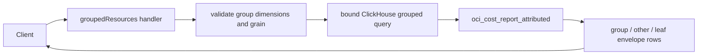

# CostScope Cost API

Standalone, read-only Go API for the CostScope dashboard. It queries the existing ClickHouse view `oci_cost_report_attributed` directly; it does not create or mutate ClickHouse objects.

## Architecture assumption

Because only the API structure was requested, this scaffold intentionally uses the Go standard library (`net/http`) and manual constructor injection. That keeps a small read-only service easy to operate and test. Replace the placeholder `github.com/example/costscope-api` module path before adopting it in your repository.

The source view is assumed to already implement correction reconciliation and latest-tags-per-OCID backfill. The service does not duplicate or reinterpret that accounting logic.

## Required cost dimensions

The view is expected to expose these normalized columns in addition to the OCI report fields:

| API filter | View column | Source tag |
|---|---|---|
| `env` | `env` | `ATD-Billing.Environment` |
| `cost_center` | `cc` | `ATD-Billing.CostCenter` |
| `component_type` | `comp` | `ATD-Billing.ComponentType` |
| `resource_type` | `rtype` | `ATD-Ops.ResourceType` |
| `resource_name` | `rname` | `ATD-Ops.ResourceName` |

When `rname` is blank, every resource-name API value uses the composite `untagged · <product_service> · …<OCID tail>`. This is the canonical breakdown, filter-option, and filter value; it round-trips verbatim. This replaces the prior description-based value, so existing `resource_name=__untagged__` links no longer match.

## Routes

- `GET /healthz`
- `GET /v1/costs/summary`
- `GET /v1/costs/exec-summary?dimension=cost_center&top=7` — aggregate payload for the executive summary page in one round trip: `data` object with `summary`, `monthly`, `cost_centers`, `environments`, `top_breakdown` (limit 20), `top_series` (one monthly series per top-N `dimension` value, `top` 1–20 default 7), and `freshness` (best-effort, `null` if the freshness query fails). Sub-queries run concurrently server-side; accepts all shared filters.
- `GET /v1/costs/timeseries?granularity=hour|day|month`
- `GET /v1/costs/breakdown?dimension=service|compartment|environment|cost_center|component_type|resource_type|resource_name&series=true&granularity=day` — `series=true` adds each row's `{date, cost}` series at the selected granularity. In series mode the row `cost` and every series `cost` are decimal strings (never floats — parse only at display); the default mode keeps the numeric `cost` unchanged.
- `GET /v1/costs/resources?page=1&limit=50&sort=cost&direction=desc`
- `GET /v1/costs/resources/grouped?group1=environment&group2=cost_center&grain=month` -- grouped USD-only resource-month rows for the direct Resources view; use `group1_value` and `group2_value` to expand a parent, and `q` for server-side case-insensitive text search
- `GET /v1/costs/resources/{ocid}` — accepts the shared date and dimension filters in addition to the path OCID, so detail cost stays scoped to the originating Resources view
- `GET /v1/costs/lineitems?resource_name=X&granularity=day|week|month` (or `ocid=X`) — bucketed cost detail under shared filters; resource name and OCID are optional narrowers, and granularity defaults to day
- `GET /v1/costs/filters` — accepts the shared filters and returns only values valid under them, enabling cascading filter controls.
- `GET /v1/costs/freshness`
- `GET /openapi.yaml` — embedded OpenAPI 3.0 spec
- `GET /docs` — Swagger UI (assets pinned to swagger-ui-dist@5.17.14 via CDN with SRI)

## Logging

Structured JSON via `log/slog` on stdout. `LOG_LEVEL` env: debug|info|warn|error (default info). Every request is logged with method, path, status, duration_ms, and request_id.

Shared filters: `start`, `end`, `env`, `cost_center`, `component_type`, `compartment`, `service`, `resource_type`, `resource_name`, and `ocid`. Pass `__untagged__` for blank values except `resource_name`: blank resource-name tags are exposed only through their canonical composite `untagged · <product_service> · …<OCID tail>` value. Timestamps are RFC3339. The default range is one month, the maximum is 400 days, breakdowns are limited to 100 rows, and resource pages to 500 rows.

All values are bound with ClickHouse placeholders. The only interpolated SQL fragments are service-owned allowlisted dimensions, sort columns/directions, and time buckets. Cost is always `cost_attributedcost` from the reconciled attributed view. Currency remains a grouping dimension so unlike currencies are never silently summed together.

Success and error responses share an envelope:

```json
{"data":[],"meta":{"freshness":{"data_through":"...","loaded_at":"..."}},"error":null}
```

```json
{"data":null,"meta":{},"error":{"code":"VALIDATION_ERROR","message":"..."}}
```

## Grouped resources endpoint

`GET /v1/costs/resources/grouped` is additive; it leaves the paginated
`/v1/costs/resources` endpoint unchanged. It accepts the shared filter and date
scope, plus these query parameters:

| Parameter | Required | Purpose |
|---|---:|---|
| `group1` | yes | `service`, `compartment`, `environment`, `cost_center`, `component_type`, `resource_type`, `resource_name`, or `period` |
| `group2` | no | A different grouping dimension for a second expandable level |
| `group1_value` | no | First parent value for expansion; `__untagged__` scopes blank tag values |
| `group2_value` | no | Second parent value; requires `group1_value` and `group2` |
| `q` | no | Case-insensitive substring across resource name, OCID, service, compartment, region, type, and tags |
| `hide_zero` | no | When `true`, drops groups/leaves whose rounded cost is $0 ("hide noise") |
| `grain` | no | Must be `month`; resource leaves are resource-month rows |

The query always filters the physical `cost_currencycode` column to USD before
aggregation. Group and `other` rows contain `kind`, `depth`, `group_value`,
`currency`, `subtotal_cost`, and `row_count`; `other` is terminal and represents
the aggregate of children after the top 15. Leaf rows have `kind: "leaf"` and
include period, tag, resource, OCID, currency, and decimal-string cost fields.

Example request:

```http
GET /v1/costs/resources/grouped?group1=environment&group2=cost_center&group1_value=dev&q=payments&grain=month
```

Example response:

```json
{"data":[{"kind":"group","depth":1,"group_value":"platform","currency":"USD","subtotal_cost":"24.50","row_count":3}],"meta":{"freshness":{"data_through":"...","loaded_at":"..."}},"error":null}
```



## Run locally

```bash
cp .env.example .env
# Export the values using your preferred environment loader.
go mod download
go run -tags clickhouse ./cmd/cost-api
```

Use a ClickHouse principal with `SELECT` permission only on `oci_cost_report_attributed`. No credentials should be embedded in a client application.

## Test

```bash
go test ./...
```

The focused tests exercise parameter binding, identifier allowlists, resource-name fallback, request validation, envelopes, and routing without requiring ClickHouse.

The official `clickhouse-go/v2` implementation is selected with the `clickhouse` build tag. The default build uses a compile-only stub so unit tests remain independent of the driver and a running database; do not use the untagged binary in production.
